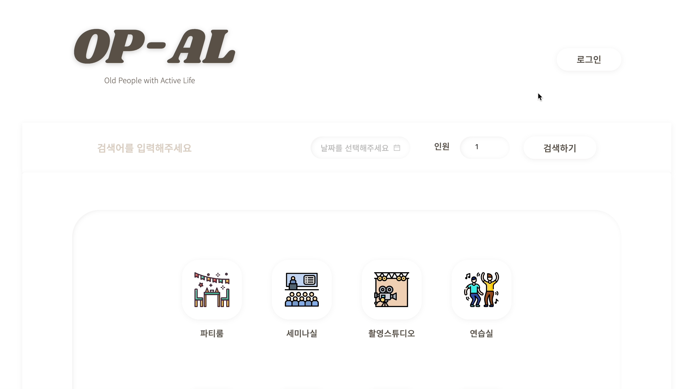

# 🗂 OP-AL

> **O**ld **P**eople with **A**ctive **L**ife <br />  
> React, TypeScript, REST API를 활용한 쇼핑몰 프로젝트 <br />  
> 인생의 제 2막을 시작한 5060세대의 여가 및 건강 활동을 위한 공간을 소개·대여하는 공간 대여 플랫폼<br />

<br />

## 📌 프로젝트 소개

> **패스트캠퍼스 프론트엔드 개발 부트캠프 5기**<br />  
> **개발 기간** : 2023.05.30 - 2023.07.02<br />  
> **배포 링크** : **[OP-AL](https://zippy-sable-b21ba3.netlify.app/)**<br />  
> **Repository** : [OP-AL](https://github.com/OP-AL/opal)<br />

<br />

## 📌 개발 팀원 및 역할

### 패스트캠퍼스 프론트엔드 5기

| <a href="https://github.com/wngkfla01"></a> | <a href="https://github.com/cuconveniencestore"></a> | <a href="https://github.com/dmswl2030"></a> | <a href="https://github.com/DevYBecca"></a> | <a href="https://github.com/nangkong98"> |
| :------------------------------------------------------------------------------------------------------------------------------------: | :----------------------------------------------------------------------------------------------------------------------------------------------: | :------------------------------------------------------------------------------------------------------------------------------------: | :-------------------------------------------------------------------------------------------------------------------------------------: | :----------------------------------------------------------------------------------------------------------------------------------: |
|                                                 [주하림](https://github.com/wngkfla01)                                                 |                                                 [이시우](https://github.com/cuconveniencestore)                                                  |                                                 [이은지](https://github.com/dmswl2030)                                                 |                                                 [윤금엽](https://github.com/DevYBecca)                                                  |                                               [강동훈](https://github.com/nangkong98)                                                |
|                      GitHub 팀장<br /> 초기 개발 세팅<br /> 리덕스 설정<br /> 마이 페이지<br /> (계좌, 구매내역)                       |                                                전체 디자인<br /> 제품 검색 기능<br /> 검색 리스트                                                |                                        로그인<br /> 회원가입<br /> 마이 페이지<br /> (내 정보)                                         |                                              제품 상세 페이지<br /> 제품 결제 페이지<br />                                              |                                                           더미데이터 수집                                                            |

## 📌 기술 스택

### Development


### Config


### Library


### Environment


### Deployment


### Cowork Tools


## 📌 구현 페이지 및 프리뷰

**1️⃣ 메인 페이지**

- 제품 검색, 이벤트 배너, 지금 뜨는 곳, 퀵메뉴(예약 정보 확인)

  <details>
    <summary>프리뷰</summary>
    
  </details>

**2️⃣ 제품 페이지**

- 제품 리스트, 상세 페이지, 결제 페이지

  <details>
    <summary>프리뷰</summary>
    
  </details>

**3️⃣ 마이 페이지**

- 내 정보 수정, 내 계좌 관리, 구매 내역 조회

  <details>
    <summary>프리뷰</summary>
    
  </details>

**4️⃣ 인증**

- 로그인, 회원가입

  <details>
    <summary>프리뷰</summary>
    
  </details>

  <br />

## 📌 구현 화면

| 메인 페이지<br/>(로그인 전)                                                                                           | 메인 페이지<br/>(로그인 후)                                                                                                       |
| --------------------------------------------------------------------------------------------------------------------- | --------------------------------------------------------------------------------------------------------------------------------- |
|  |  |

| 로그인                                                                                                                  | 회원가입                                                                                                                |
| ----------------------------------------------------------------------------------------------------------------------- | ----------------------------------------------------------------------------------------------------------------------- |
|  |  |

| 메인 페이지 퀵메뉴<br/>(로그인 후)                                                                                              | 제품 검색 페이지                                                                                                        |
| ------------------------------------------------------------------------------------------------------------------------------- | ----------------------------------------------------------------------------------------------------------------------- |
|  |  |

| 제품 상세 페이지                                                                                                               | 제품 결제 페이지                                                                                                                |
| ------------------------------------------------------------------------------------------------------------------------------ | ------------------------------------------------------------------------------------------------------------------------------- |
|  |  |

| 마이 페이지<br/>(내 정보)                                                                                                    | 마이 페이지<br/>(내 계좌)                                                                                                       |
| ---------------------------------------------------------------------------------------------------------------------------- | ------------------------------------------------------------------------------------------------------------------------------- |
|  |  |

| 마이 페이지<br/>(구매 내역)                                                                                                      | 마이 페이지<br/>(구매 취소)                                                                                                        |
| -------------------------------------------------------------------------------------------------------------------------------- | ---------------------------------------------------------------------------------------------------------------------------------- |
|  |  |

## 📌 담당 페이지 및 기능 구현

### 제품 상세 페이지 & 제품 결제 페이지

#### 1. 제품 ID를 파라미터로 전달받아 제품별 상세페이지 구현

> 제품 검색 페이지에서 제품 클릭 시 `Link 컴포넌트에서 URL 경로에 동적인 제품 ID`를 담고,<br />
> `Route path`를 통해 ProductDetail.tsx에 제품 ID를 파라미터로 전달한다.<br />
> 제품 상세 페이지에서는 `useParams()`를 이용해 파라미터 값을 받아와 api에 호출하여 상세 데이터를 출력한다.<br />
> `useParams()` Hook으로 제품에 대한 페이지를 개별적으로 생성하지 않고,<br />
> 변경되는 파라미터만 전달하여 api 호출을 할 수 있다.<br />

```TypeScript
// ProductItem.tsx
<Link
  to={`/productdetail/${list.id}`}
  key={index}
  className="productItem__info-container"
>

// Routes.tsx
<Routes>
  <Route path="/productlist" element={<ProductList />} />
  <Route path="/productdetail/:id" element={<ProductDetail />} />
  ...
</Routes>

// ProductDetail.tsx
const { id } = useParams();
```

#### 2. 사용자의 accessToken을 react-cookie로 관리하기

> api를 제공해주신 강사님께서 회원가입 시 사용자의 `accessToken을 Local Storage에 저장하는 방법`을 추천해주셨는데,
> Local Storage에서 accessToken을 관리하다 보니 멘토님과의 점검에서 문제가 발생하였고
> 멘토님께서 `cookies에 저장하는 방법`을 권유해주셨다.<br />
> (브라우저의 탭이나 창을 닫았다가 열었을 때 `로그인 상태가 그대로 유지됨` => 보안성 문제 有)<br />
> 현업에서는 session Storage나 cookies를 이용하는 경우가 많다고 답변 해주셨고,<br />
> 회원가입 기능을 담당하지는 않았지만 상세 페이지 및 결제 페이지에서도 상태 관리로 사용하던<br />
> Redux에 문제가 생겨 cookie를 사용했으니 추가적인 학습을 해두면 좋을 것 같다.<br />

```TypeScript
// SignUp.tsx
const [cookies, setCookies] = useCookies(['accessToken']); // 변수로 지정한 cookie의 이름으로 초기화

async function handleSignUp(event: FormEvent) {
  // ...
  try {
      const signUpData = await signUpApi(requestBody);
      await authenticateCheck(signUpData.accessToken);
      const accessToken = signUpData.accessToken; // 사용자의 accessToken을 변수로 지정
      setCookies('accessToken', accessToken, { path: '/' }); // 쿠키의 도메인을 최상위 경로로 지정
  // ...
  }
}

// ProductDetail.tsx
const [accessCookies] = useCookies(['accessToken']);
const accessToken = accessCookies.accessToken;
const [dateCookies, setDateCookies] = useCookies(['selectedDateTime']);
const [productInfoCookies, setProductInfoCookies] = useCookies([
  'productInfo',
]);

// ...
const handleProductPayment = () => {
    if (accessToken) {
      setDateCookies(
        'selectedDateTime',
        {
          startTime: startTime,
          endTime: endTime,
          timeDiffer: timeDiffer,
        },
        { path: '/' }
      );
      // ...
    }
    // ...
}
```

#### 3. map() 함수로 반복문을 이용해 컴포넌트 구현

> 이번 프로젝트 시작 전, JavaScript와 React 학습이 부족한 상황이었고 일주일 정도 빠르게 학습을 진행했었다.<br />
> `map()` 함수는 배열의 각 요소를 순회하면서 새로운 배열을 반환하기 때문에 반복문에 사용해보게 되었다.<br />
> 구현 초반에 `'상세 페이지는 제품 ID마다 다르게 출력되어야 하니 반복문으로 사용해주면 되는게 아닐까?'`라고 생각했고,
> Route path의 파라미터에 `/:id`로 지정하고 제품 조회 api 호출 결과에 map() 함수를 적용했지만
> 제대로 출력이 되지 않았다.<br />
> 조원분들께 여쭤봤을 때 '변수의 상태를 보고 싶다면 `console.log`로 확인해보세요'라는 팁과 함께<br />
> map() 함수를 잘못 사용하고 있다는 것을 알게 되었다😭<br />
> (동적인 제품 ID를 파라미터로 전달해주고 출력해주기만 하면 되는데,<br />
> `배열 속에 모든 제품 데이터가 넘어오는 구조로 잘못 생각했던 것...`)<br />
> (조원분의 답변대로 map() 함수를 지워주자 파라미터로 전달된 ID에 해당하는<br />
> 제품 상세 데이터가 바로 잘 출력되었다.)<br />
> map() 함수가 잘 동작하기 위해선 `'배열 속에 데이터들이 존재해야 한다'`라는 점을 다시 깨닫고,
> 반복문에 적용해보게 되었다.
> map() 함수를 이용해 컴포넌트를 렌더링할 때 `컴포넌트의 변화를 추적하고 더 효율적으로 렌더링`하기 위해
> 고유한 식별자인 `key`를 props로 가져야 하는데 처음엔 key 값으로 왜 id를 받아야 하는지 이해가 되지 않았지만,
> 반복적으로 사용해보면서 `배열의 요소가 가진 속성 중 유니크한 값이 key가 되어야 컴포넌트들을 서로 구분하고
변경된 커포넌트만 재렌더링 할 수 있다`는 점을 이해하게 된 것 같다.<br />
> (꼭 id가 아니어도 되지만 index는 지양하기!)<br />

```TypeScript
// ProductDetail.tsx
// 제품의 tags를 가져와 해시태그 기호를 붙여 출력
const hashTags = product.tags.map((tag) => `#${tag}`);

{hashTags.map((tag, i) => (
  <Space wrap key={i}>
    <Button
      type="primary"
      shape="round"
      size={'large'}
      className={styles.product__tag}
    >
      <span>{hashTags[i]}</span>
    </Button>
  </Space>
))}

<div>
  {/* 제품(공간) 장소 출력 */}
  <h3 className={styles.product__address}>주소</h3>
  {productAddress.map((item, i) => (
    <p key={i}>{productAddress[i]}</p>
  ))}
</div>

```

#### 4. axios를 이용해 api와 소통하기

> 이전 개인 과제들까지는 `JavaScript 내장 함수인 fetch`를 이용해 api와 데이터를 주고 받았다.<br />
> fetch는 Promise를 반환하고, json() 메서드로 파싱이 필요하며, Node.js에서 동작하지 않기 때문에<br />
> axios를 많이 사용하고 있고 멘토님께서도 `axios를 자주 사용해보길 추천`해주셨다.<br />
> 그래서 이번 프로젝트에서 axios로 api 호출을 하기로 결정했고 코드들을 `api.ts 파일`에 작성하였다.<br />
> api 관련 코드들을 `하나의 파일에서 볼 수 있다`는 장점이 있지만, 코드가 길어지다 보니 `가독성이 떨어져서`<br />
> `기능별로 api를 분리하여 파일을 관리해주는 방법이 더 좋겠다`는 생각을 하게 되었다.<br />

```TypeScript
// api.ts
export async function productDetailApi(id: string) {
  const res = await axios.get(`${BASE_URL}/products/${id}`, {
    headers,
  });
  const data: ProductDetailResponseData = res.data;
  return data;
}

```

```TypeScript
// ProductDetail.tsx
useEffect(() => {
  const fetchProduct = async () => {
    try {
      const productDetailData = await productDetailApi(id as string);
      // ...
    }
  };
  fetchProduct();
}, [id]);

// ProductPayment.tsx
try {
  const requestBody: PaymentRequestBody = {
    productId: productInfo.id,
    accountId: pickedAccount,
    reservation: {
      start: cookieSavedDate.startTime,
      end: cookieSavedDate.endTime,
    },
  };

  // 제품(공간) 구매 신청(결제)
  await productPaymentApi(accessToken, requestBody);
  // ...

// 제품 거래(구매)신청 - POST
export interface PaymentRequestBody {
  productId: string; // 거래할 제품 ID (필수!)
  accountId: string; // 결제할 사용자 계좌 ID (필수!)
  reservation: {
    // 예약 정보
    start: string; // 예약 시작 시간(ISO)
    end: string; // 예약 종료 시간(ISO)
  };
}
```

#### 5. React의 Lifecycle과 useEffect

> 프로젝트 시작 전 빠르게 React를 학습하면서 `컴포넌트에 Lifecycle이라는 인생 주기가 있고 작성해둔 특정 코드가
실행될 시점을 지정할 수 있어` html 렌더링이 빠른 사이트를 구현할 때 유용하다는 점을 알게 되었다.<br />
> `useEffect()`를 이용해 컴포넌트가 `mount`, `unmount`, `update` 되는 시점 중 동작하는 시점을 조절할 수 있고,<br />
> 두 번째 파라미터로 `의존성 배열`을 받아 그 요소(변수, state)가 변경될 때만 useEffect() 내에 작성한 코드가<br />
> 실행되는데 React로 페이지를 구현하다보니 필수불가결적인 함수라는 사실을 알게 되었고, 도입하게 되었다.<br />

```TypeScript
// ProductDetail.tsx
useEffect(() => {
    const fetchProduct = async () => {
      try {
        // URL 파라미터로 받은 ID를 매개변수로 담아 단일 제품 상세 조회 api 호출
        const productDetailData = await productDetailApi(id as string);
        // api 호출 결과로 받아온 데이터를 Redux로 상태 관리 중인 updateProductDetail의 상태로 업데이트
        dispatch(updateProductDetail(productDetailData));
      } catch (error) {
        console.log(error as Error);
      }
    };
    fetchProduct();
}, [id]); // 의존성 배열로 id를 지정해주어 제품의 고유한 ID가 바뀔 때마다 api를 재호출하도록 함
```

#### 6. Redux로 상태 관리 도입

> 프로젝트 설계 과정 중 React로 현업에서 개발을 해보셨던 조원분께서 `'상태 관리 라이브러리로 Redux를 많이 사용하던데,
이번 프로젝트에 도입 해보면서 같이 익혀보면 좋겠다'`는 제안을 해주셔서 Redux로 처음 상태 관리를 도전해보게 되었다.<br />
> props로 넘겨주는 useState에 비해 사전에 학습할 내용이 많아 더 간결하다는 `redux-toolkit`으로 진행했고<br />
> GitHub 팀장을 담당하셨던 조원분께서 redux 기본 세팅을 해주시고 사용해보면서 감을 익히게 된 것 같다.<br />
> (하지만 아직도 개념에 대해서는 이해가 가지 않아 추가적인 학습이 필요하다.)

```TypeScript
// redux > store.tsx
import { configureStore } from '@reduxjs/toolkit';
import reducers from './reducer/reducer';

// reducer.tsx 파일에서 내보내진 reducer들을 configureStore에 전달하여 하나로 결합합니다.
const store = configureStore({
  reducer: reducers,
});

// redux > reducer > reducer.tsx
import { createSlice, PayloadAction } from '@reduxjs/toolkit';

interface ProductState {
  id: string;
  title: string;
// ...
```

> 단일 제품 상세 데이터, datePicker에서 선택한 입실 및 퇴실 시간, 인원 수, 선택한 계좌를 Redux로 관리 했는데<br />
> `'제품 결제 페이지를 새로고침할 경우 제품 상세 페이지에서 선택한 옵션들이 초기화되는 문제'`를 발견했다😭<br />
> 재렌더링이 되더라도 상태를 초기화 하지 않고 유지해주는 라이브러리가 있다는 얘기를 들었지만<br />
> 마감 날짜가 촉박하여 Redux로 상태 관리를 하고 있던 변수들을 `cookie로 변경`하게 되었다.<br />
> 조원분이 작성해주신 코드가 merge된 내용들도 있어 관련 코드들은 리팩토링이 반드시 필요할 것 같다😭<br />

<br />

## 📌 프로젝트 회고

> 이전까지 개인 과제들만 수행하다 진행하는 첫 팀 프로젝트고 JavaScript와 React 학습을 많이 못한 상태라 민폐를 끼칠까 걱정이 많이 됐다.
> 프론트엔드 팀원들끼리 기획, 설계, 디자인, 개발을 모두 진행해야 해서 아이디어 회의에 약 일주일을 투자했는데 덕분에
> 프로젝트 전반적으로 이해가 잘 됐던 것 같고, `개발자라고 개발에만 집중할 게 아니라 트렌드나 디자인에도
관심을 많이 가져야겠다`는 생각을 하게 되었다.<br />
> 아직 미숙하지만 JavaScript 문법이나 React에 대해 보다 친숙해질 수 있었고, 모르는 부분이 생긴다면 생각만 할 것이 아니라
> 코드 곳곳에 `console.log`를 찍어보며 구현 과정 중 `어느 부분에서 문제가 생겼는지 확인해보는 방법도 도움이 많이 되고
검색을 잘하는 것도 센스와 실력이 필요함`을 느끼게 되었다.
> 그리고 이전엔 `코드를 어디서부터 어떻게 봐야할지 감이 안잡혀` 혼란스러웠는데, `조금이나마 '숲'에서 '나무'를 보는 방법`을 익히게 됐다.
> `GitHub repository로 협업하며 특강에서 학습했던 명령어들에 굉장히 익숙해졌으며` stash를 활용하는 방법을 조원분께서 알려주셔서
> 서로 수월하게 작업할 수 있었고, 충돌을 겪은 적이 거의 없었던 것 같다.<br />
> Redux로 관리하던 변수들을 cookie로 대체하거나, 결제 과정 중 출력되는 Modal 등은 다른 조원분들이 코드를 합쳐주신 내역들이 있어서
> 리팩토링을 통해 hooks 분리, 코드 정리, 주석으로 코드에 대한 설명 추가 등의 작업을 진행해봐야겠다💪🏻<br />
